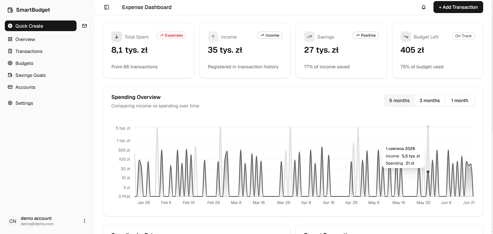

# SmartBudget 💰

A personal finance management web application for tracking expenses, managing budgets, and achieving savings goals.



🔗 **Live demo**: [finance-app-lukaszkrzem.vercel.app](https://finance-app-lukaszkrzem.vercel.app)

> **🚀 Try it out!** > Use the **"Login as Guest"** button on the login page, or use the test credentials:
> **Email:** `demo@demo.com`
> **Password:** `haslo`

> ⚠️ The backend is hosted on Render's free tier and may take up to 50 seconds to wake up after a period of inactivity.

---

## Features

- **Transaction tracking** — add income and expenses with category, currency, and description
- **Multi-currency support** — exchange rates fetched automatically from the NBP API
- **Scheduled transactions** — set up recurring payments (daily, weekly, monthly, yearly)
- **Budget management** — define spending limits per category with real-time progress tracking
- **Savings goals** — create goals with target amounts, deadlines, and track contributions
- **Notifications** — automatic alerts when a budget limit is exceeded
- **Google OAuth** — sign in with Google or register with email and password

---

## Tech Stack

**Frontend**

- React + Vite
- Redux Toolkit
- React Router
- Tailwind CSS + shadcn/ui
- Recharts

**Backend**

- Python + FastAPI
- SQLAlchemy
- PostgreSQL (Neon)
- JWT authentication
- Google OAuth2

---

## Getting Started

### Prerequisites

- Node.js
- Python 3.10+
- PostgreSQL (or a Neon account)

### Backend

```bash
cd back
pip install -r requirements.txt
```

Create a `.env` file in `back/`:

```env
DATABASE_URL=your_postgres_connection_string
SECRET_KEY=your_secret_key
GOOGLE_CLIENT_ID=your_google_client_id
```

Run the server:

```bash
uvicorn back.main:app --reload
```

### Frontend

```bash
cd front
npm install
```

Create a `.env` file in `front/`:

```env
VITE_API_URL=http://localhost:8000
VITE_GOOGLE_CLIENT_ID=your_google_client_id
```

Run the dev server:

```bash
npm run dev
```

---

## Project Structure

```
financeApp/
├── back/                   # FastAPI backend
│   ├── dto/                # Pydantic schemas
│   ├── routers/            # API endpoints
│   ├── service/            # Business logic
│   ├── tests/              # Unit tests
│   ├── database.py         # Database connection
│   ├── dependencies.py     # Shared dependencies (auth)
│   ├── main.py             # App entry point
│   └── structure.py        # SQLAlchemy models
├── front/                  # React frontend
│   └── src/
│       ├── app/            # App-level setup
│       ├── components/     # Reusable UI components
│       │   └── ui/         # shadcn/ui primitives
│       ├── hooks/          # Custom React hooks
│       ├── lib/            # Utilities (e.g. category icons)
│       └── pages/          # Page components
└── db/
    └── init/               # Database initialization scripts
```

---

## License

MIT
