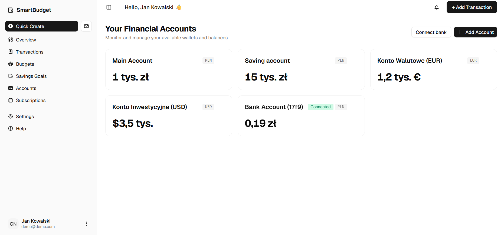
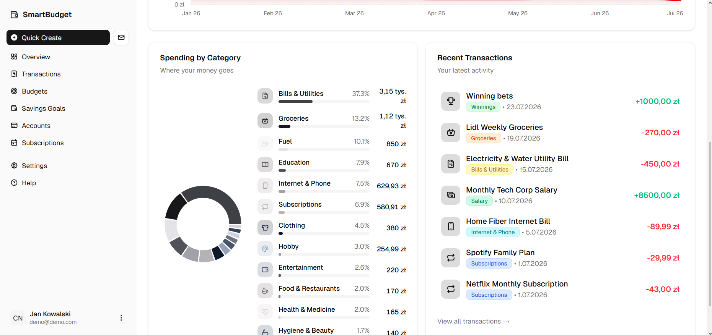
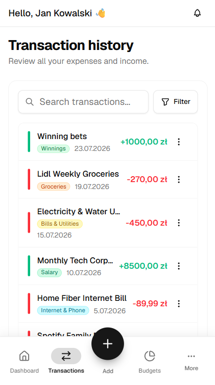

# SmartBudget 💰

A personal finance management web application for tracking expenses, managing budgets, and achieving savings goals.


🔗 **Live demo**: [finance-app-lukaszkrzem.vercel.app](https://finance-app-lukaszkrzem.vercel.app)

> **🚀 Try it out!** Use the **"Try demo"** button on the login page, or use the test credentials:
> **Email:** `demo@demo.com`
> **Password:** `haslo`

> ⚠️ The backend is hosted on Render's free tier and may take up to 50 seconds to wake up after a period of inactivity.

---

## Screenshots





---

## Features

- **Transaction tracking** — add income and expenses with categories, multi-currency support, and descriptions
- **Multi-currency & NBP Sync** — exchange rates fetched automatically with historical rate tracking via NBP API
- **Passkeys & Biometric Auth** — passwordless sign-in supporting WebAuthn (Touch ID, Face ID, YubiKey)
- **PWA Ready** — installable Progressive Web App with mobile-responsive design
- **Scheduled transactions** — automated recurring payments (daily, weekly, monthly, yearly)
- **Budget management** — define spending limits per category with real-time progress tracking
- **Savings goals** — create target-based goals with deadlines and track progress
- **Google OAuth & JWT** — sign in with Google or standard email/password authentication
- **Demo Account Guard** — built-in protection ensuring live demo safety without restricting functionality
- **Dark / Light Theme** — full theme customizability

---

## Tech Stack

**Frontend**

- React 19 + Vite
- Tailwind CSS v4 + shadcn/ui
- @simplewebauthn (Passkeys / WebAuthn)
- Recharts (Interactive visual data)
- Vite PWA

**Backend**

- Python 3.10+ + FastAPI
- SQLAlchemy 2.0 (PostgreSQL)
- WebAuthn (PyWebAuthn)
- Pytest (Automated test suite)
- JWT & Google OAuth2 Authentication

---

## Getting Started

### Prerequisites

- Node.js (v18+)
- Python 3.10+
- PostgreSQL (or a Neon account)

### Backend

```bash
cd back
pip install -r requirements.txt
```

Create a `.env` file in `back/`:

```env
DATABASE_URL=your_postgres_connection_string
SECRET_KEY=your_secret_key
GOOGLE_CLIENT_ID=your_google_client_id
```

Run the API server:

```bash
uvicorn back.main:app --reload
```

Run backend tests:

```bash
pytest
```

### Frontend

```bash
cd front
npm install
```

Create a `.env` file in `front/`:

```env
VITE_API_URL=http://localhost:8000
VITE_GOOGLE_CLIENT_ID=your_google_client_id
```

Run the development server:

```bash
npm run dev
```

---

## Project Structure

```
financeApp/
├── back/                   # FastAPI backend
│   ├── dto/                # Pydantic schemas
│   ├── routers/            # API endpoints (Auth, WebAuthn, Transactions, Budgets, etc.)
│   ├── service/            # Core business logic (NBP sync, WebAuthn, Demo Guard)
│   ├── tests/              # Pytest integration & unit tests
│   ├── database.py         # DB connection & session management
│   ├── main.py             # FastAPI entry point
│   └── structure.py        # SQLAlchemy models
├── front/                  # React frontend
│   └── src/
│       ├── components/     # Reusable UI components & shadcn primitives
│       ├── context/        # React Context providers (Auth, Data, Theme)
│       ├── hooks/          # Custom React hooks
│       └── pages/          # Application views & pages
├── db/                     # DB initialization scripts
└── docker-compose.yml      # Local PostgreSQL container configuration
```

---

## License

MIT
