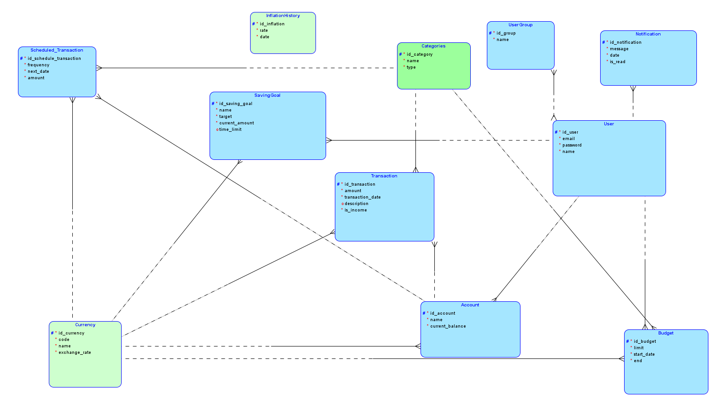

# 💰 Finance App

Aplikacja webowa do zarządzania finansami osobistymi. Umożliwia śledzenie transakcji, zarządzanie kontami bankowymi, tworzenie budżetów, celów oszczędnościowych oraz automatycznych płatności cyklicznych.

---

## 📋 Spis treści

- [Opis projektu](#-opis-projektu)
- [Stos technologiczny](#-stos-technologiczny)
- [Architektura systemu](#-architektura-systemu)
- [Schemat bazy danych](#-schemat-bazy-danych)
- [Instalacja i uruchomienie](#-instalacja-i-uruchomienie)
- [API — Dokumentacja endpointów](#-api--dokumentacja-endpointów)
- [Frontend — Opis stron](#-frontend--opis-stron)
- [Struktura plików](#-struktura-plików)
- [Testowanie](#-testowanie)
- [Testowanie API z Postmanem](#-testowanie-api-z-postmanem)

---

## 🎯 Opis projektu

Finance App to pełnostackowa aplikacja umożliwiająca:

- **Rejestrację i logowanie** — standardowe (email + hasło) oraz przez Google OAuth2
- **Zarządzanie kontami** — tworzenie kont bankowych w różnych walutach, automatyczne tworzenie domyślnego konta przy rejestracji
- **Śledzenie transakcji** — dodawanie przychodów i wydatków z automatycznym przeliczaniem walut (kursy z API NBP)
- **Budżety** — definiowanie limitów wydatków per kategoria z monitorowaniem stopnia wykorzystania; automatyczne powiadomienia przy przekroczeniu limitu
- **Cele oszczędnościowe** — definiowanie celów z kwotą docelową, bieżącą, datą rozpoczęcia i terminem
- **Transakcje cykliczne** — automatyczne generowanie transakcji o zadanej częstotliwości (dziennie, tygodniowo, miesięcznie, rocznie)
- **Powiadomienia** — system powiadomień generowanych automatycznie przez triggery bazodanowe (np. przy przekroczeniu budżetu)
- **Obsługa wielu walut** — kursy walut aktualizowane automatycznie z API NBP

---

## 🛠 Stos technologiczny

| Warstwa       | Technologia                                                    |
|---------------|----------------------------------------------------------------|
| **Backend**   | Python 3, FastAPI, SQLAlchemy, Pydantic, Uvicorn               |
| **Frontend**  | React 19, Vite 8, TailwindCSS 4, shadcn/ui, Recharts, Radix UI |
| **Baza danych** | PostgreSQL 15 (Neon / Docker)                                |
| **Auth**      | JWT (python-jose), Argon2 (passlib), Google OAuth2             |
| **Inne**      | Docker Compose, httpx (kursy walut NBP)                        |

---

## 🏗 Architektura systemu

Aplikacja opiera się na architekturze trójwarstwowej:

```
┌────────────────────────────────────────────────────┐
│                   FRONTEND (React)                 │
│          Vite dev server → localhost:5173           │
│    Strony: Home, Login, Register, Dashboard,       │
│    Transactions, Accounts, Budgets, SavingsGoals   │
└────────────────────┬───────────────────────────────┘
                     │ REST API (fetch + Bearer Token)
┌────────────────────▼───────────────────────────────┐
│                  BACKEND (FastAPI)                  │
│           Uvicorn server → localhost:8000           │
│                                                    │
│  Routers ──► Services ──► DTOs (Pydantic)          │
│                  │                                 │
│            SQLAlchemy ORM                          │
└────────────────────┬───────────────────────────────┘
                     │ psycopg2 (TCP :5432)
┌────────────────────▼───────────────────────────────┐
│              BAZA DANYCH (PostgreSQL 15)            │
│         Docker / Neon (chmura)                     │
│                                                    │
│  Tabele, Widoki, Procedury, Triggery, Funkcje      │
└────────────────────────────────────────────────────┘
```

### Wzorzec architektoniczny backendu

```
Routers (kontrolery)  →  Services (logika biznesowa)  →  Structure (modele ORM)
       ↕                        ↕                              ↕
  DTOs (Pydantic)          Database (sesje)             Baza danych (SQL)
```

- **Routers** — definicje endpointów REST API, walidacja danych wejściowych, zwracanie odpowiedzi
- **Services** — logika biznesowa (tworzenie użytkowników, obliczanie budżetów, operacje na celach oszczędnościowych)
- **DTOs** — obiekty transferu danych (Pydantic) do walidacji żądań i formatowania odpowiedzi
- **Structure** — modele SQLAlchemy odwzorowujące tabele bazy danych
- **Database** — konfiguracja silnika SQLAlchemy i fabryka sesji
- **Dependencies** — współdzielone zależności (np. `get_current_user` na podstawie JWT)

---

## 🗄 Schemat bazy danych

### Diagram logiczny (ERD)



### Tabele

| Tabela                   | Opis                                                   |
|--------------------------|--------------------------------------------------------|
| `User`                   | Użytkownicy systemu (email, hasło, imię)               |
| `Account`                | Konta bankowe użytkownika (nazwa, saldo, waluta)       |
| `Transaction`            | Transakcje (kwota, data, opis, typ: przychód/wydatek)  |
| `Categories`             | Kategorie transakcji (np. "Jedzenie i Kawiarnie")      |
| `Currency`               | Waluty z kursem wymiany                                |
| `Budget`                 | Budżety per kategoria z datą początku/końca            |
| `Scheduled_Transaction`  | Transakcje cykliczne (częstotliwość, następna data)    |
| `SavingGoal`             | Cele oszczędnościowe (cel, bieżąca kwota, termin)      |
| `Notification`           | Powiadomienia systemowe (wiadomość, status odczytu)    |
| `InflationHistory`       | Historia inflacji (kurs, data)                         |
| `UserGroup`              | Grupy użytkowników                                     |
| `Relation_14`            | Tabela pośrednia User ↔ UserGroup                      |

### Kluczowe relacje (FK)

- `Account` → `User` (ON DELETE CASCADE), `Currency`
- `Transaction` → `Account` (ON DELETE CASCADE), `Categories` (ON DELETE SET NULL), `Currency`
- `Budget` → `User` (ON DELETE CASCADE), `Categories`, `Currency`
- `Scheduled_Transaction` → `Account` (ON DELETE CASCADE), `Categories`, `Currency`
- `SavingGoal` → `User` (ON DELETE CASCADE), `Currency`
- `Notification` → `User` (ON DELETE CASCADE)

### Widoki (Views)

#### `v_budget_analytics`

Widok zbierający dane analityczne budżetów:
- Dane budżetu (limit, daty, kategoria, waluta)
- `current_spent` — suma wydatków w danej kategorii w okresie budżetu (z przeliczeniem walut)
- `percent_used` — procentowe wykorzystanie budżetu

### Procedury składowane

#### `catch_up_scheduled_transactions(p_user_id INT)`

Procedura nadrabiająca zaległe transakcje cykliczne. Dla każdej zaplanowanej transakcji użytkownika, której `next_date ≤ CURRENT_DATE`:
1. Generuje brakujące transakcje dla każdego minionego okresu
2. Przelicza kwoty z uwzględnieniem kursów walut
3. Aktualizuje saldo konta
4. Przesuwa `next_date` na następny termin

Obsługiwane częstotliwości: `DAILY`, `WEEKLY`, `MONTHLY`, `YEARLY`.

### Triggery

| Trigger                       | Tabela          | Zdarzenie      | Opis                                                                 |
|-------------------------------|-----------------|----------------|----------------------------------------------------------------------|
| `trg_create_def_acc`          | `User`          | AFTER INSERT   | Tworzy domyślne konto "Main Account" z saldem 0.00 PLN              |
| `trg_check_budget_overflow`   | `Transaction`   | AFTER INSERT   | Sprawdza czy wydatek przekracza limit budżetu; jeśli tak — tworzy powiadomienie |

---

## 🚀 Instalacja i uruchomienie

### Wymagania

- Python 3.10+
- Node.js 18+
- Docker i Docker Compose (opcjonalnie, do lokalnej bazy danych)
- Konto Neon (alternatywa dla Dockera — baza w chmurze)

### 1. Baza danych

#### Opcja A: Docker (lokalna baza)

```bash
# Z katalogu głównego projektu (finance-app/)
docker-compose up -d
```

Dane konfiguracyjne:
- **Host:** `localhost:5432`
- **User:** `admin`
- **Password:** `password123`
- **Database:** `finance_app`

> ⚠️ Upewnij się, że port 5432 nie jest zajęty przez inną bazę danych!

Skrypt `db/init/init_db.sql` uruchomi się automatycznie przy pierwszym starcie kontenera i utworzy wszystkie tabele, widoki, triggery, procedury oraz dane startowe.

#### Opcja B: Neon (baza w chmurze)

Plik `back/.env` zawiera connection string do bazy Neon. Do użycia z Neon należy zakomentować linię tworzącą tabele w `back/main.py`:

```python
# back.database.Base.metadata.create_all(bind=back.database.engine)
```

### 2. Backend

```bash
cd back

# Utwórz wirtualne środowisko
python -m venv venv

# Aktywuj środowisko (Windows)
venv\Scripts\activate

# Zainstaluj zależności
pip install -r requirements.txt

# Uruchom serwer
uvicorn back.main:app --reload
```

Serwer startuje na **http://localhost:8000**.

Automatyczna dokumentacja API (Swagger UI) dostępna pod: **http://localhost:8000/docs**

### 3. Frontend

```bash
cd front

# Zainstaluj zależności
npm install

# Uruchom dev server
npm run dev
```

Aplikacja startuje na **http://localhost:5173**.

### Zmienne środowiskowe (`back/.env`)

| Zmienna        | Opis                                                  |
|----------------|-------------------------------------------------------|
| `DATABASE_URL` | Connection string do PostgreSQL (Neon lub lokalny)    |

---

## 📡 API — Dokumentacja endpointów

Bazowy URL: `http://localhost:8000`

Endpointy wymagające autoryzacji używają nagłówka:
```
Authorization: Bearer <token>
```

### 🔐 Users (Autoryzacja)

| Metoda | Ścieżka          | Auth | Opis                                        | Body / Response                    |
|--------|-------------------|------|---------------------------------------------|------------------------------------|
| POST   | `/register`       | ❌   | Rejestracja nowego użytkownika              | `UserCreate` → `TokenResponse`     |
| POST   | `/login`          | ❌   | Logowanie (email + hasło)                   | `UserLogin` → `TokenResponse`      |
| POST   | `/auth/google`    | ❌   | Logowanie/rejestracja przez Google OAuth2   | `{ token: string }` → `TokenResponse` |
| GET    | `/me`             | ✅   | Pobierz dane zalogowanego użytkownika       | — → `UserOut`                      |

**DTO:**

```
UserCreate:     { email: EmailStr, password: str, name: str }
UserLogin:      { email: EmailStr, password: str }
UserOut:        { id_user: int, email: str, name: str }
TokenResponse:  { token: str, token_type: str, user: UserOut }
```

### 🏦 Accounts (`/accounts`)

| Metoda | Ścieżka      | Auth | Opis                                              | Body / Response                  |
|--------|--------------|------|----------------------------------------------------|----------------------------------|
| GET    | `/accounts/` | ✅   | Lista kont użytkownika (+ wywołuje nadrabianie zaległych transakcji cyklicznych) | → `List[AccountOut]`     |
| POST   | `/accounts/` | ✅   | Utwórz nowe konto                                 | `AccountCreate` → `AccountOut`   |

**DTO:**

```
AccountCreate:  { name: str, current_balance: float, Currency_id_currency: int }
AccountOut:     { id_account: int, name: str, current_balance: float, 
                  Currency_id_currency: int, currency_code: str }
```

### 💸 Transactions (`/transactions`)

| Metoda | Ścieżka            | Auth | Opis                                              | Body / Response                       |
|--------|---------------------|------|-----------------------------------------------------|---------------------------------------|
| POST   | `/transactions/`    | ✅   | Dodaj transakcję (automatyczna aktualizacja kursów NBP i salda konta) | `TransactionCreate` → `TransactionOut` |
| GET    | `/transactions/`    | ✅   | Lista transakcji użytkownika (z kategorią i walutą)  | → `List[TransactionOut]`              |

**DTO:**

```
TransactionCreate:  { amount: Decimal, description?: str, type: "INCOME"|"EXPENSE",
                      Account_id_account: int, Category_id_category?: int, 
                      Currency_id_currency: int = 1 }
TransactionOut:     { id_transaction: int, amount: Decimal, date: datetime,
                      description?: str, type: "INCOME"|"EXPENSE",
                      Account_id_account: int, category_name?: str,
                      exchange_rate?: float, currency_code?: str }
```

> Przy tworzeniu transakcji automatycznie pobierane są aktualne kursy walut z API NBP i aktualizowane w bazie.

### 📊 Budgets (`/budgets`)

| Metoda | Ścieżka               | Auth | Opis                          | Body / Response               |
|--------|------------------------|------|-------------------------------|-------------------------------|
| POST   | `/budgets/`            | ✅   | Utwórz budżet                | `BudgetCreate` → `BudgetOut`  |
| GET    | `/budgets/`            | ✅   | Lista budżetów z analityką   | → `List[BudgetOut]`           |
| DELETE | `/budgets/{budget_id}` | ✅   | Usuń budżet                  | — → `204 No Content`          |

**DTO:**

```
BudgetCreate:  { limit: Decimal (>0), start_date: date, end: date,
                 Categories_id_category: int, Currency_id_currency: int }
                 Walidacja: end >= start_date
BudgetOut:     { id_budget: int, limit: Decimal, start_date: date, end: date,
                 categories_id_category: int, category_name: str,
                 currency_id_currency: int, currency_code: str,
                 current_spent: Decimal, percent_used: float }
```

### 🔄 Scheduled Transactions (`/scheduled-transactions`)

| Metoda | Ścieżka                       | Auth | Opis                                   | Body / Response                             |
|--------|--------------------------------|------|-----------------------------------------|---------------------------------------------|
| POST   | `/scheduled-transactions/`     | ✅   | Utwórz transakcję cykliczną            | `ScheduledTransactionCreate` → `ScheduledTransactionOut` |
| GET    | `/scheduled-transactions/`     | ✅   | Lista transakcji cyklicznych           | → `List[ScheduledTransactionOut]`            |

**DTO:**

```
ScheduledTransactionCreate:  { frequency: str, next_date: date, amount: Decimal,
                               type: "INCOME"|"EXPENSE", description?: str,
                               Account_id_account: int, Category_id_category: int }
ScheduledTransactionOut:     { id_schedule_transaction: int, frequency: str,
                               next_date: date, amount: Decimal, description?: str,
                               Account_id_account: int, Category_id_category: int }
```

Obsługiwane wartości `frequency`: `DAILY`, `WEEKLY`, `MONTHLY`, `YEARLY`

### 🎯 Savings Goals (`/savings-goals`)

| Metoda | Ścieżka                       | Auth | Opis                                          | Body / Response                       |
|--------|--------------------------------|------|------------------------------------------------|---------------------------------------|
| GET    | `/savings-goals/`              | ✅   | Lista celów oszczędnościowych                 | → `List[SavingsGoalOut]`              |
| POST   | `/savings-goals/`              | ✅   | Utwórz cel oszczędnościowy                    | `SavingsGoalCreate` → `SavingsGoalOut`|
| PATCH  | `/savings-goals/{goal_id}`     | ✅   | Aktualizuj cel (częściowa aktualizacja)       | `SavingsGoalUpdate` → `SavingsGoalOut`|
| PATCH  | `/savings-goals/{goal_id}/add` | ✅   | Dodaj wpłatę do celu                          | `SavingsGoalContribution` → `SavingsGoalOut` |
| DELETE | `/savings-goals/{goal_id}`     | ✅   | Usuń cel                                      | — → `204 No Content`                  |

**DTO:**

```
SavingsGoalCreate:        { name: str, target: Decimal (>0), current_amount: Decimal (≥0) = 0,
                            time_limit?: date, Currency_id_currency: int = 1 }
SavingsGoalUpdate:        { name?: str, target?: Decimal (>0), current_amount?: Decimal (≥0),
                            time_limit?: date, Currency_id_currency?: int }
SavingsGoalContribution:  { amount: Decimal (>0) }
SavingsGoalOut:           { id_saving_goal: int, name: str, target: Decimal,
                            current_amount: Decimal, start_date: date, time_limit?: date,
                            User_id_user: int, Currency_id_currency: int,
                            currency_code: str, percent_complete: float }
```

### 🔔 Notifications (`/notifications`)

| Metoda | Ścieżka                              | Auth | Opis                            | Body / Response                   |
|--------|---------------------------------------|------|----------------------------------|-----------------------------------|
| GET    | `/notifications/`                     | ✅   | Pobierz nieprzeczytane powiadomienia | → `List[NotificationOut]`      |
| PATCH  | `/notifications/{notification_id}/read` | ✅ | Oznacz powiadomienie jako przeczytane | — → `{ status, message }`     |

**DTO:**

```
NotificationOut:  { id_notification: int, message: str, date: datetime,
                    is_read: str, User_id_user: int }
```

### 📂 Categories (`/categories`)

| Metoda | Ścieżka         | Auth | Opis                          | Response         |
|--------|------------------|------|-------------------------------|------------------|
| GET    | `/categories/`   | ❌   | Lista wszystkich kategorii    | → `List[Category]` |

### 💱 Currencies (`/currencies`)

| Metoda | Ścieżka         | Auth | Opis                          | Response               |
|--------|------------------|------|-------------------------------|------------------------|
| GET    | `/currencies/`   | ❌   | Lista wszystkich walut        | → `List[CurrencyOut]`  |

**DTO:**

```
CurrencyOut:  { id_currency: int, code: str, name: str, exchange_rate: Decimal }
```

### 🏥 Health Check

| Metoda | Ścieżka | Auth | Opis                    | Response                                  |
|--------|---------|------|--------------------------|-------------------------------------------|
| GET    | `/`     | ❌   | Sprawdzenie statusu API | `{ status: "online", message: "test" }`   |

---

## 🖥 Frontend — Opis stron

Frontend zbudowany jest w React 19 z Vite jako bundlerem. Używa TailwindCSS 4 do stylizacji, shadcn/ui do komponentów UI, i Recharts do wykresów.

| Strona            | Ścieżka              | Auth  | Opis                                                              |
|-------------------|-----------------------|-------|-------------------------------------------------------------------|
| **Home**          | `/`                   | ❌    | Strona główna (niezalogowani), przekierowanie do Dashboard po zalogowaniu |
| **Login**         | `/login`              | ❌    | Logowanie (email + hasło lub Google OAuth2)                       |
| **Register**      | `/register`           | ❌    | Rejestracja (email + hasło lub Google OAuth2)                     |
| **Dashboard**     | `/dashboard`          | ✅    | Panel główny z podsumowaniem (karty, wykresy, ostatnie transakcje)|
| **Transactions**  | `/transactions`       | ✅    | Przeglądanie transakcji w tabeli z sortowaniem                    |
| **Accounts**      | `/accounts`           | ✅    | Lista kont z saldami i możliwością dodawania nowych               |
| **Budgets**       | `/budgets`            | ✅    | Lista budżetów z analityką wykorzystania                         |
| **Savings Goals** | `/savings-goals`      | ✅    | Cele oszczędnościowe z paskiem postępu, wpłatami, edycją          |
| **Settings**      | `/settings`           | ✅    | Ustawienia użytkownika                                            |

### Kluczowe komponenty

| Komponent                   | Opis                                                           |
|-----------------------------|----------------------------------------------------------------|
| `Layout`                    | Wrapper z sidebar i nagłówkiem dla zalogowanych stron           |
| `app-sidebar`               | Nawigacja boczna z linkami do sekcji                            |
| `site-header`               | Nagłówek z breadcrumbem i powiadomieniami                      |
| `section-cards`             | Karty podsumowania na Dashboard (saldo, przychody, wydatki)    |
| `chart-area-interactive`    | Interaktywny wykres obszarowy transakcji w czasie              |
| `spending-categories`       | Wykres kołowy wydatków per kategoria                           |
| `recent-transactions`       | Lista ostatnich transakcji                                     |
| `data-table`                | Zaawansowana tabela danych z sortowaniem i filtrowaniem        |
| `AddTransactionDialog`      | Dialog do dodawania transakcji                                 |
| `AddAccountDialog`          | Dialog do dodawania konta                                      |
| `AddBudgetDialog`           | Dialog do dodawania budżetu                                    |
| `nav-user`                  | Menu użytkownika w sidebarze (wyloguj)                         |

### Routing i autoryzacja

- Token JWT przechowywany w `localStorage`
- Niezalogowany użytkownik jest przekierowywany na `/` (Home)
- Zalogowany użytkownik jest przekierowywany z `/`, `/login`, `/register` na `/dashboard`
- Po zalogowaniu dane (konta, transakcje, budżety, kategorie, waluty) pobierane automatycznie

---

## 📁 Struktura plików

```
finance-app/
├── docker-compose.yml          # Konfiguracja Docker (PostgreSQL)
├── LogicalV1.png               # Diagram ERD bazy danych
│
├── back/                       # Backend (FastAPI)
│   ├── .env                    # Zmienne środowiskowe (DATABASE_URL)
│   ├── main.py                 # Punkt wejścia aplikacji FastAPI
│   ├── database.py             # Konfiguracja SQLAlchemy (engine, sesje)
│   ├── structure.py            # Modele ORM (tabele bazy danych)
│   ├── dependencies.py         # Współdzielone zależności (get_current_user)
│   ├── requirements.txt        # Zależności Pythona
│   │
│   ├── routers/                # Kontrolery REST API
│   │   ├── user_router.py      # /register, /login, /me, /auth/google
│   │   ├── account_router.py   # /accounts
│   │   ├── transaction_router.py # /transactions
│   │   ├── budget_router.py    # /budgets
│   │   ├── category_router.py  # /categories
│   │   ├── scheduled_router.py # /scheduled-transactions
│   │   ├── savings_goal_router.py # /savings-goals
│   │   ├── notification_router.py # /notifications
│   │   └── currency_router.py  # /currencies
│   │
│   ├── service/                # Logika biznesowa
│   │   ├── auth_service.py     # JWT, haszowanie haseł, Google OAuth2
│   │   ├── user_service.py     # Operacje na użytkownikach
│   │   ├── budget_service.py   # CRUD budżetów + analityka (widok)
│   │   ├── notification_service.py # Powiadomienia
│   │   └── savings_goal_service.py # CRUD celów oszczędnościowych
│   │
│   ├── dto/                    # Data Transfer Objects (Pydantic)
│   │   ├── user_dto.py
│   │   ├── account_dto.py
│   │   ├── transaction_dto.py
│   │   ├── budget_dto.py
│   │   ├── scheduled_transaction_dto.py
│   │   ├── savings_goal_dto.py
│   │   ├── notification_dto.py
│   │   └── currency_dto.py
│   │
│   └── tests/                  # Testy jednostkowe
│       ├── conftest.py         # Konfiguracja testów (SQLite in-memory)
│       ├── test_auth.py        # Testy autoryzacji
│       ├── test_user_router.py # Testy endpointów użytkownika
│       └── test_user_service.py # Testy serwisu użytkownika
│
├── db/                         # Baza danych
│   └── init/
│       └── init_db.sql         # Skrypt inicjalizacyjny (DDL + DML + procedury + triggery)
│
└── front/                      # Frontend (React + Vite)
    ├── package.json
    ├── vite.config.js
    ├── index.html
    └── src/
        ├── App.jsx             # Główny komponent z routingiem i stanem
        ├── App.css             # Style globalne
        ├── main.jsx            # Punkt wejścia React
        ├── pages/              # Strony aplikacji
        │   ├── Home.jsx
        │   ├── Login.jsx
        │   ├── Register.jsx
        │   ├── Dashboard.jsx
        │   ├── Transactions.jsx
        │   ├── Accounts.jsx
        │   ├── Budgets.jsx
        │   ├── SavingsGoals.jsx
        │   └── Settings.jsx
        ├── components/         # Komponenty UI
        │   ├── Layout.jsx
        │   ├── app-sidebar.jsx
        │   ├── site-header.jsx
        │   ├── section-cards.jsx
        │   ├── chart-area-interactive.jsx
        │   ├── spending-categories.jsx
        │   ├── recent-transactions.jsx
        │   ├── data-table.jsx
        │   ├── simple-data-table.jsx
        │   ├── AddTransactionDialog.jsx
        │   ├── AddAccountDialog.jsx
        │   ├── AddBudgetDialog.jsx
        │   ├── nav-main.jsx
        │   ├── nav-user.jsx
        │   ├── nav-documents.jsx
        │   ├── nav-secondary.jsx
        │   └── ui/             # Komponenty shadcn/ui
        └── hooks/
            └── use-mobile.js   # Hook do detekcji urządzeń mobilnych
```

---

## 🧪 Testowanie

### Uruchamianie testów

```bash
cd back
pytest
```

Testy używają **SQLite in-memory** jako bazy testowej (konfiguracja w `tests/conftest.py`). Dzięki temu testy są szybkie i nie wymagają uruchomionej bazy PostgreSQL.

### Istniejące testy

| Plik                   | Opis                                                |
|------------------------|------------------------------------------------------|
| `test_auth.py`         | Testy hashowania haseł, tworzenia/weryfikacji tokenów JWT |
| `test_user_router.py`  | Testy endpointów rejestracji, logowania, `/me`       |
| `test_user_service.py` | Testy serwisu użytkownika (tworzenie, wyszukiwanie)  |

### Konfiguracja testowa (`conftest.py`)

- Używa SQLite in-memory (`sqlite:///:memory:`)
- Każdy test działa w transakcji, która jest cofana po zakończeniu (izolacja)
- `TestClient` z FastAPI z nadpisaną zależnością `get_db`

---

## 📬 Testowanie API z Postmanem

1. Uruchom aplikację (backend + baza danych)
2. Zarejestruj użytkownika przez frontend lub bezpośrednio przez API
3. W Postmanie wyślij **POST** do `http://localhost:8000/login`:
   ```json
   {
       "email": "a@a.a",
       "password": "a"
   }
   ```
4. Skopiuj wartość `token` z odpowiedzi
5. W nowym żądaniu przejdź do zakładki **Authorization** → typ **Bearer Token** → wklej token
6. Teraz możesz testować chronione endpointy, np.:

   **POST** `http://localhost:8000/transactions/`
   ```json
   {
       "amount": 1.0,
       "description": "Testowa transakcja",
       "type": "EXPENSE",
       "Account_id_account": 1,
       "Category_id_category": 1
   }
   ```
